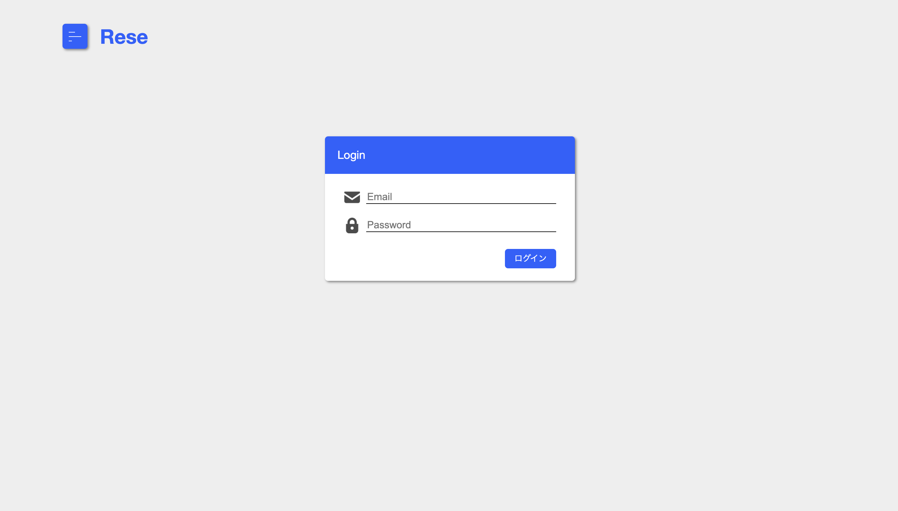
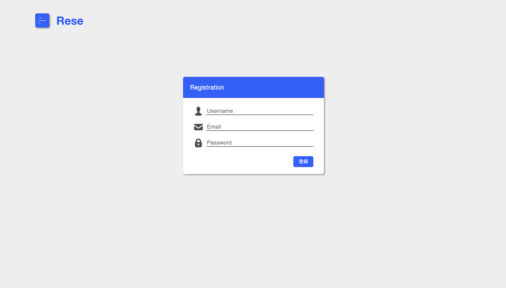
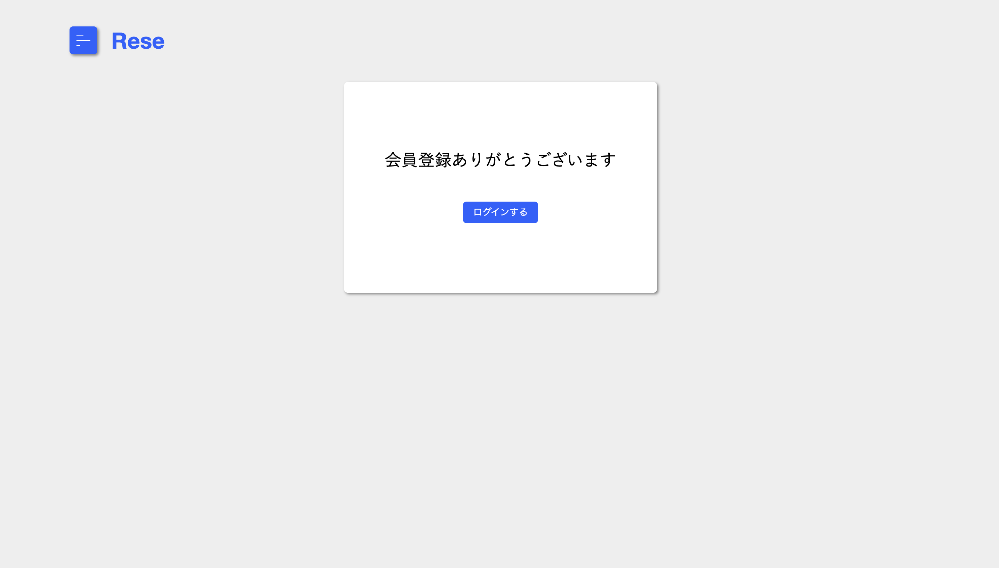
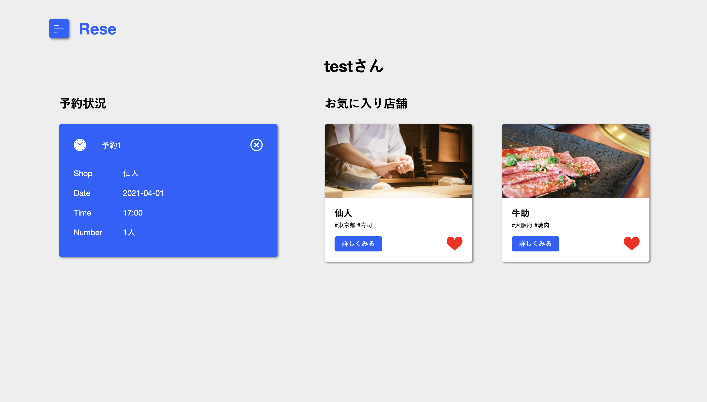
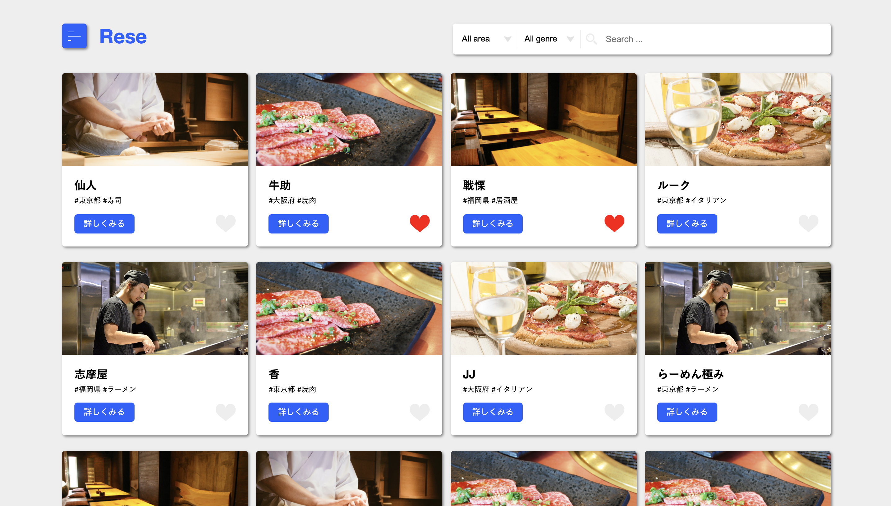
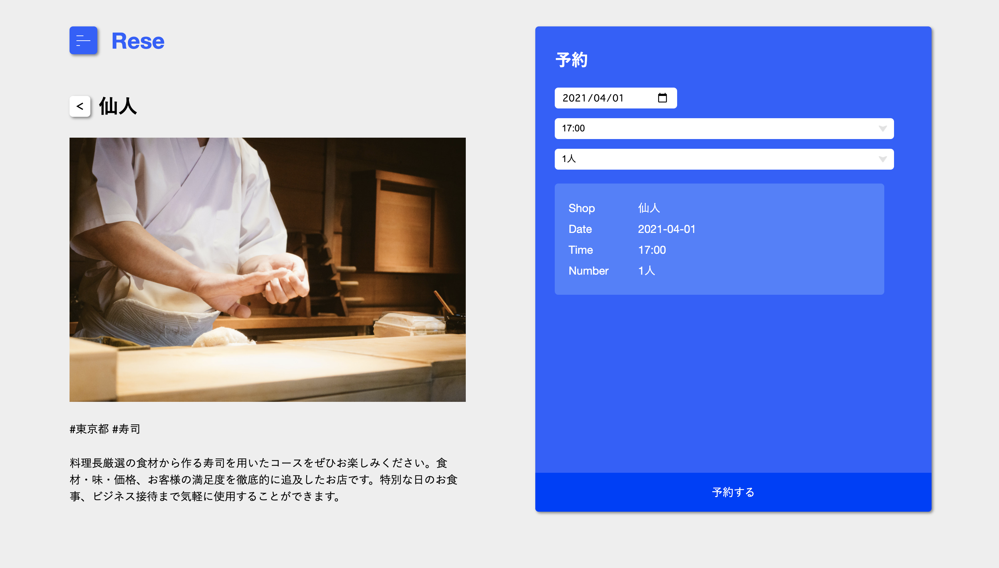
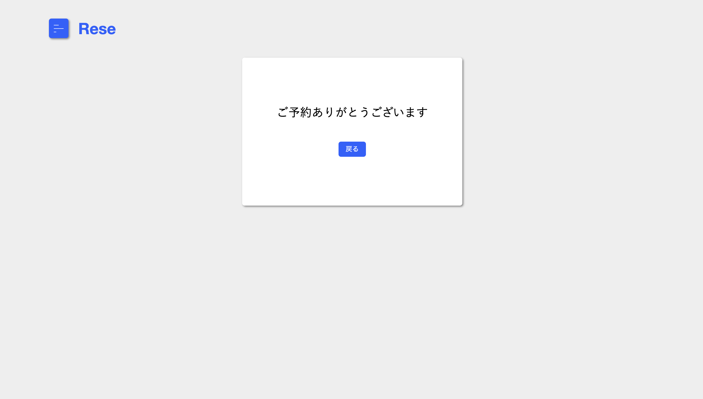
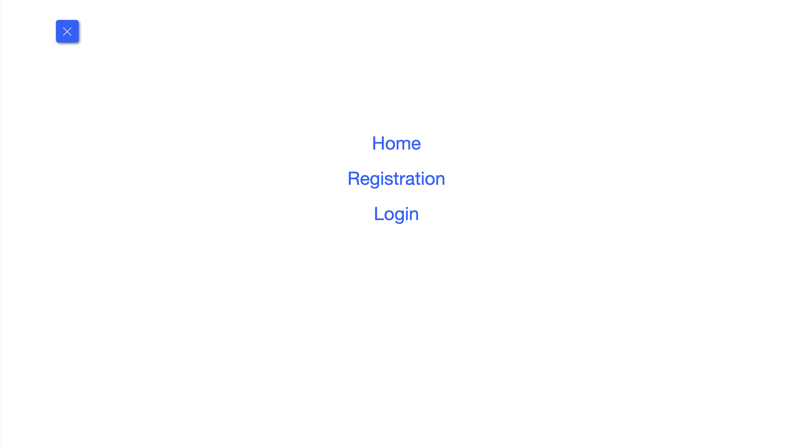
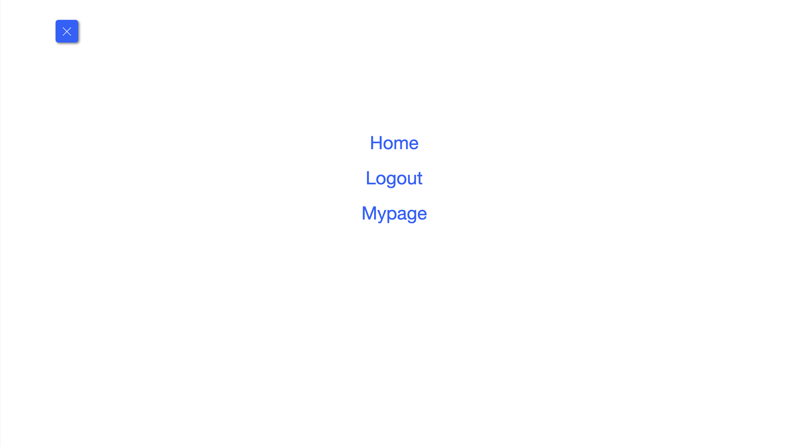

#　アプリケーション名: Rese

## ページ一覧

- ログインページ

- ユーザー登録ページ

- サンクスページ(ユーザー登録後に)

- マイページ

- 飲食店一覧ページ

- 飲食店詳細ページ

- 予約完了ページ

- ログイン前メニューページ

- ログイン後メニューページ

## 目的・目標
- 目的：外部の飲食店予約サービスは手数料を取られるので自社で予約サービスを持ちたい
- 目標：初年度でのユーザー数10,000人達成

##　　アプリケーションURL
- 開発環境：http://localhost/
- phpMyAdmin: Http://localhost:8080/

##　機能一覧
認証機能
- ユーザー登録
- ログイン・ログアウト機能

飲食店一覧ページ
- 飲食店の全件を表示する
- 詳細ボタンを押すことで詳細ページに移行
- お気に入りを登録・削除(ハートを押すことで)
- 飲食店検索機能(エリア・ジャンル・店名で指定できる)

飲食店予約
- 日にち、時間、人数を予約可能(詳細ページにて)
- 予約完了後、予約完了ページを表示する

マイページ(ユーザー情報)
- 予約状況を表示
- お気に入りした飲食店を表示

## 使用技術
　開発言語：PHP

　フレームワーク：Laravel 3.8

　バージョン管理：GitHub

## ER図

## 環境構築
Dockerビルド

1.git clone git

2.docker-compose up -d --build
Laravel環境構築

1.docker-compose exec php bash
2.composer install
3..env.exampleファイルから.envを作成し、環境変数を変更してください
4.php artisan key:generate
5.php artisan migrate
<!-- 6.php artisan db:seed -->